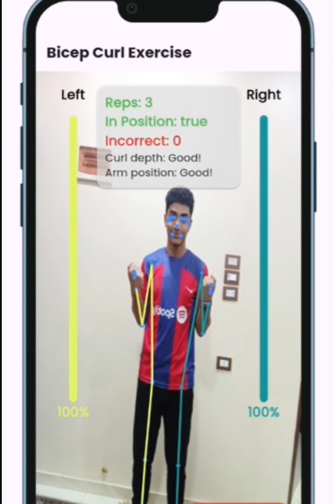

# FitiFy (Public Clean-Code Demo)

> **Note:** This repository contains a curated subset of **FitiFy**’s Flutter code, focused on illustrating my **clean architecture**, **modular design**, and **best-practice patterns**.  
> The full app—including proprietary AI modules, backend integration & extended feature set—is maintained in a private repository.

---

##  Why FitiFy?

- **Injury Prevention & Efficiency**  
  Traditional fitness routines often rely on guesswork. FitiFy flags improper posture instantly, enabling real-time form correction to reduce injury risk.

- **Effortless Tracking**  
  Auto-rep counting and live feedback—no tapping, no interruptions. Focus entirely on your workout while FitiFy handles the rest.

- **Your Privacy, Our Priority**  
  All image processing runs **entirely on device**. Raw photos never leave your phone; only anonymized landmark coordinates are sent to our secure AI servers.

---

##  Core Features

1. **Real-Time Pose Estimation**  
   AI tracks your posture and delivers live voice cues for perfect form.

2. **Auto Rep Counting**  
   Hands-free repetition counter—tracking biceps curls, squats, planks, push-ups & leg raises.

3. **Form Correction System**  
   Voice-guided prompts correct your technique to minimize injury.

4. **Gamified Challenges**  
   Earn points, climb leaderboards, and tackle interactive workouts.

5. **Community Module**  
   Share posts, comment, like—and stay motivated together.

6. **AI Chatbot**  
   Instant fitness & nutrition advice via our in-app AI assistant.

---

## 🛠️ Tech Stack & Architecture Highlights

- **State Management:** GetX (Controllers)  
- **Networking:** Dio + WebSockets for real-time data streams  
- **ML Integration:** Google ML Kit Pose Detection (on-device inference)  
- **Voice Feedback:** flutter_tts for text-to-speech prompts  
- **UI/UX:** Neumorphic “3D” design elements, responsive layouts  
- **Clean Architecture:**  
  - `data/` – Repositories, API services, WebSocket handlers  
  - `models/` – JSON-serializable DTOs (using json_serializable)  
  - `controllers/` – GetX controllers as ViewModels  
  - `views/` – Widgets / Screens (Stateless / GetView)  
  - `utils/` – Helpers, theming, and constants  

